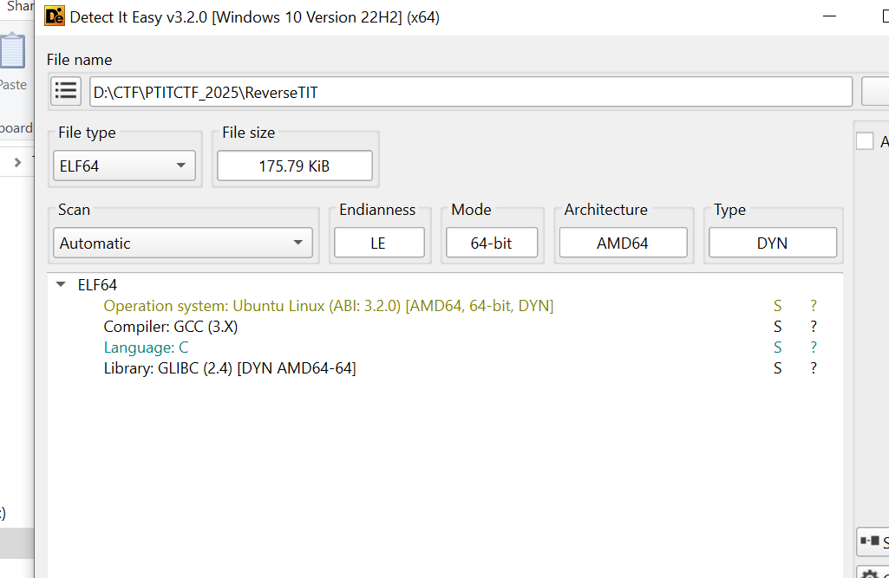

# WU RE PTITCTF2025

# ReverseTIT



- Check file thì ra đây là file ELF, chạy thử


→ Không thấy gì lắm

→ Dùng IDA phân tích


- Nhìn vào hàm main ta thấy đầu tiên có check prefix, có load mảng để sau này check, sau đó gọi input. Trong quá trình lướt các hàm thì mình có vô tình thấy cả hàm tên **SHA1**


Có thể thấy ở đây len của input phải là 48, ta đã biết flag form là PTITCTF{…}.

- Đi vào sec_check ta thấy đây chỉ là SHA1 20 bytes của v12 rồi trả về thôi


- Đi vào xem nội dung của v11:

```cpp
v67 = 48;
v68 = 97;
v69 = 52;
v70 = 100;
v71 = 56;
v72 = 50;
v73 = 99;
v74 = 97;
v75 = 97;
v76 = 102;
v77 = 55;
v78 = 52;
v79 = 51;
v80 = 52;
v81 = 54;
v82 = 99;
v83 = 52;
v84 = 48;
v85 = 99;
v86 = 97;
v87 = 48;
v88 = 98;
v89 = 97;
v90 = 54;
v91 = 57;
v92 = 102;
v93 = 56;
v94 = 57;
v95 = 51;
v96 = 54;
v97 = 57;
v98 = 55;
v99 = 50;
v100 = 52;
v101 = 99;
v102 = 97;
v103 = 57;
v104 = 48;
v105 = 51;
v106 = 53;
v29 = v54;
std::vector\<int\>::vector(v42, &v67, 40, v54);
std::__new_allocator\<int\>::\~__new_allocator(v54);
...
```

Dùng AI tóm tắt ra được:

1. `0a4d82caaf74346c40ca0ba69f89369724ca9035`
2. `ea9259b4a6f43783cdf6aa523e9db3412963b31c`
3. `156cc4c77e3bf1dcb387b189b56309dde6ef6220`
4. `b5efa8eadf6f33f30d19468ebdf52d155526d2de`
5. `987e2a2582fa4ddd068259c1ae224615e5062157`
6. `6512cf6bb1044e3dc68030a8d6d669257dafa9bc`
7. `44e5a6f66307595eae078a70dd059662aadfc43b`
8. `7925a6c0d9b673bbdef61b8f4c45fe3e14ba9e03`
9. `a7a3472af6383407428a85ed8062165fb2ca772f`
10. `6fa550f5c70df6f3b67e3483ba841a2aa2a0a89e`
11. `2ae7b876a4073754b71cc8501a3fc2b255c154ce`
12. `542ec1a1f6d635ffa543cc877622854254d8e25f`
13. `c1d5e47df628b6ca0f1f832e6dd29897e2b0b9fe`

Code solve

```jsx
import hashlib
import itertools
import string

hashes = [
    "0a4d82caaf74346c40ca0ba69f89369724ca9035",
    "ea9259b4a6f43783cdf6aa523e9db3412963b31c",
    "156cc4c77e3bf1dcb387b189b56309dde6ef6220",
    "b5efa8eadf6f33f30d19468ebdf52d155526d2de",
    "987e2a2582fa4ddd068259c1ae224615e5062157",
    "6512cf6bb1044e3dc68030a8d6d669257dafa9bc",
    "44e5a6f66307595eae078a70dd059662aadfc43b",
    "7925a6c0d9b673bbdef61b8f4c45fe3e14ba9e03",
    "a7a3472af6383407428a85ed8062165fb2ca772f",
    "6fa550f5c70df6f3b67e3483ba841a2aa2a0a89e",
    "2ae7b876a4073754b71cc8501a3fc2b255c154ce",
    "542ec1a1f6d635ffa543cc877622854254d8e25f",
    "c1d5e47df628b6ca0f1f832e6dd29897e2b0b9fe",
]

charset = string.ascii_letters + string.digits + "_"

table = {}
for s in itertools.product(charset, repeat=3):
    t = ''.join(s)
    h = hashlib.sha1(t.encode()).hexdigest()
    table[h] = t

ans = []
for h in hashes:
    ans.append(table.get(h, "???"))

inside = ''.join(ans)
print("PTITCTF{" + inside + "}")
```

**→ Flag: PTITCTF{7h47_15_7h3_W4Y_W3_50lv3_7h15_ch4ll3n93}**

# chronomancerv2

- Cho file vào IDA, xem nd hàm start ngay đầu file ta thấy nó khởi tạo rồi gọi window


- Vào hàm đó ta thấy main ở sub_140002A30


- Vào main ta thấy một mớ vẽ cửa sổ, có hàm để call hàm check các kiểu nút bấm, flag… ở sub_140002070


- Tìm một hồi ta thấy hàm này:


Nó ứng với 3 nút sau trên screen:


Nhìn rõ 3 hàm nhỏ check input ta thấy:


2 phần đầu tạo script solve bằng AI

```python
#calcv1
import socket

name = socket.gethostname()[:15]  # GetComputerNameA buffer size 16 incl null
rev = name[::-1]

echo = 101
for j, ch in enumerate(rev):
    echo += (j + 1) * ord(ch)

print("ComputerName:", name)
print("Echo of Self:", echo)

#ra 8873
```

```python
#calcv2
v2 = (-16657) & 0xffff   # 0xBEEF

for i in range(100):
    v2 = (26125 * v2 - 3233) & 0xffff

print(v2)
#ra 15347
```

Thực ra đến đây là ta giải được rồi vì bên dưới nó append v15 là input2 vào flag:


Nhưng để giải tiếp v3 ra:

```python
a1 ^ 0x1234 = 480282 / 3 = 160094
-> a1 = 160094 ^ 0x1234 = 156522
```

Thử vào ta được flag:


**→ Flag: PTITCTF{t1m3_is_n0t_l1n3ar_15347}**

# Summoner

Chall cho hint sau:

Hint :
Check the DLLs around you
There is a huge backdoor in the program.
Please focus on the global variable.

Unzip file ra ta được


Sau một hồi tra cứu AI thì nó trả lời mình là


→ Thử bắt nội dung bằng x64dbg (không được)

- Thử tạo các souls ảo (không được)
- Patch thử biến toàn cục đếm ma thành 100000 trực tiếp qua dãy bytes

8B 08 FF C1 89 08 → C7 00 A0 86 01 00


Fail → patch nhầm biến hiển thị, search immediate 100000 ra biến nào

Tra AI một hồi mình thấy 1 đoạn dữ liệu bị IDA hiểu nhầm nên ko xử lý pseudo (Update: Không phải nó hiểu nhầm mà là do file dll kia nó compress đoạn đấy lại nên IDA không hiện), “u” ra rồi tìm thì thấy đoạn sau:


→ khá khả nghi vì nó check =99999

patch thành


Chạy ra hiện tượng lạ → đúng cmnr


Nó đổi mợ nó background của t rồi


**→ Flag: PTITCTF{SC4Ry_R3v_ChA11_R1G5T???}**

# Baby_VM

Cho 1 file chall, dùng DIE ta có:


→ Unpack nó ra bằng PyInstxtractor


Dùng lệnh này do mình từng liên kết direc của [PyInstxtractor.py](http://PyInstxtractor.py) với pyex.bat

Unpack ra cả tá file pyc nên mình dùng AI gen code đọc file pyc luôn

```python
#!/usr/bin/env python3
import sys
import os
import hashlib

from xdis.load import load_module
from xdis.bytecode import Bytecode

def main():
    if len(sys.argv) != 2:
        print(f"Usage: {sys.argv[0]} chall.pyc")
        return

    path = sys.argv[1]

    if not os.path.exists(path):
        print(f"Không tìm thấy file: {path}")
        return

    with open(path, "rb") as f:
        raw = f.read()

    print("=" * 80)
    print(f"File   : {path}")
    print(f"Size   : {len(raw)} bytes")
    print(f"SHA256 : {hashlib.sha256(raw).hexdigest()}")
    print("=" * 80)

    try:
        loaded = load_module(path)
    except Exception as e:
        print("[!] xdis không load được file.")
        print(f"{type(e).__name__}: {e}")
        return

    print("[DEBUG] xdis.load_module returned:")
    print(f"Count: {len(loaded)}")
    for i, v in enumerate(loaded):
        preview = repr(v)
        if len(preview) > 160:
            preview = preview[:160] + "..."
        print(f"  [{i}] {type(v).__name__}: {preview}")
    print()

    # xdis các version khác nhau trả tuple hơi khác nhau.
    # Thường code object nằm ở phần tử đầu tiên có thuộc tính co_code.
    code = None
    for item in loaded:
        if hasattr(item, "co_code") and hasattr(item, "co_consts"):
            code = item
            break

    if code is None:
        print("[!] Không tìm thấy code object trong kết quả load_module.")
        return

    print("[CODE OBJECT]")
    dump_code_info(code)

    print()
    print("[DISASSEMBLY]")
    dis_code_recursive(code)

    print()
    print("[INTERESTING CONSTANTS]")
    dump_consts_recursive(code)

    print()
    print("[DATA ARRAY CANDIDATES]")
    dump_data_candidates(code)

def dump_code_info(code, indent=0):
    p = " " * indent

    print(f"{p}co_name      : {getattr(code, 'co_name', 'N/A')}")
    print(f"{p}co_filename  : {getattr(code, 'co_filename', 'N/A')}")
    print(f"{p}co_argcount  : {getattr(code, 'co_argcount', 'N/A')}")
    print(f"{p}co_nlocals   : {getattr(code, 'co_nlocals', 'N/A')}")
    print(f"{p}co_stacksize : {getattr(code, 'co_stacksize', 'N/A')}")
    print(f"{p}co_flags     : {getattr(code, 'co_flags', 'N/A')}")
    print(f"{p}co_names     : {getattr(code, 'co_names', 'N/A')}")
    print(f"{p}co_varnames  : {getattr(code, 'co_varnames', 'N/A')}")

    print(f"{p}co_consts:")
    for i, c in enumerate(getattr(code, "co_consts", [])):
        if hasattr(c, "co_code"):
            print(f"{p}  [{i}] <code object {getattr(c, 'co_name', '?')}>")
        else:
            r = repr(c)
            if len(r) > 250:
                r = r[:250] + "..."
            print(f"{p}  [{i}] {r}")

def dis_code_recursive(code, indent=0):
    p = " " * indent

    print()
    print(f"{p}{'=' * 80}")
    print(f"{p}DISASSEMBLY: {getattr(code, 'co_name', '?')}")
    print(f"{p}Filename   : {getattr(code, 'co_filename', '?')}")
    print(f"{p}{'=' * 80}")

    try:
        bc = Bytecode(code)
        for instr in bc:
            offset = getattr(instr, "offset", "")
            opname = getattr(instr, "opname", "")
            arg = getattr(instr, "arg", "")
            argrepr = getattr(instr, "argrepr", "")

            if arg is None:
                arg = ""

            if argrepr:
                print(f"{p}{str(offset):>4} {opname:<30} {str(arg):<8} ; {argrepr}")
            else:
                print(f"{p}{str(offset):>4} {opname:<30} {str(arg):<8}")

    except Exception as e:
        print(f"{p}[!] Disassembly lỗi: {type(e).__name__}: {e}")

    for c in getattr(code, "co_consts", []):
        if hasattr(c, "co_code"):
            dis_code_recursive(c, indent + 4)

def dump_consts_recursive(code, path="root"):
    for i, c in enumerate(getattr(code, "co_consts", [])):
        cur = f"{path}.co_consts[{i}]"

        if hasattr(c, "co_code"):
            print(f"{cur}: <code object {getattr(c, 'co_name', '?')}>")
            dump_consts_recursive(c, cur)

        elif isinstance(c, str):
            if len(c) > 30:
                print(f"{cur}: str len={len(c)} {c!r}")
            else:
                print(f"{cur}: str {c!r}")

        elif isinstance(c, bytes):
            print(f"{cur}: bytes len={len(c)} preview={c[:64]!r}")

        elif isinstance(c, (tuple, list)):
            preview = list(c[:20]) if len(c) > 20 else list(c)
            print(f"{cur}: {type(c).__name__} len={len(c)} preview={preview!r}")

        elif isinstance(c, int):
            print(f"{cur}: int {c}")

def dump_data_candidates(code):
    candidates = []

    def walk(obj, where):
        if hasattr(obj, "co_code"):
            for idx, c in enumerate(getattr(obj, "co_consts", [])):
                walk(c, f"{where}.co_consts[{idx}]")
        elif isinstance(obj, (tuple, list)):
            if len(obj) > 50 and all(isinstance(x, int) for x in obj):
                candidates.append((where, obj))

    walk(code, "root")

    if not candidates:
        print("Không thấy list/tuple toàn int dài.")
        return

    for idx, (where, arr) in enumerate(candidates):
        print(f"[{idx}] {where}: len={len(arr)} preview={list(arr[:30])}")

    where, arr = max(candidates, key=lambda x: len(x[1]))

    with open("data_dump.py", "w", encoding="utf-8") as f:
        f.write("# dumped from chall.pyc\n")
        f.write(f"# path: {where}\n")
        f.write(f"data = {list(arr)!r}\n")

    print()
    print("Đã dump mảng int lớn nhất ra data_dump.py")
    print(f"Path   : {where}")
    print(f"Length : {len(arr)}")

if __name__ == "__main__":
    main()
```

Chạy code ta dump được


Quan trọng hơn thì code đã ghi được mảng để xor ra Opcode


Phần trên khi đọc mình cũng biết được là ban đầu code kiểm tra input hash SHA256 có ra chuỗi này không:

<aside>
💡

da985b099592755e04c6be1188e42c8a2c1d7a7e1783076a8127b79933cee55f

</aside>

Gen code đọc input nhưng không được, mình tức quá nhìn đề đoán bừa ra key là **virtualmachine** =))))))

Nội dung opcode:

```python
0000: 69       NOP
0001: 69       NOP
0002: b1       POP_REG1
0003: 69       NOP
0004: a1 ef    PUSH_IMM 239
0006: 71       REG1_XOR_POP
0007: a1 32    PUSH_IMM 50
0009: 69       NOP
000a: 51       REG1_ADD_POP
000b: a1 25    PUSH_IMM 37
000d: 69       NOP
000e: a1 ad    PUSH_IMM 173
0010: b2       POP_REG2
0011: 69       NOP
...
```

Đưa đoạn OPcode lên cho AI đọc ta được


Gen code đọc ngược Opcode ra flag:

```python
import re

OP = {
    0xA1: "PUSH_IMM",
    0xA2: "PUSH_REG1",
    0xA3: "PUSH_REG2",
    0xB1: "POP_REG1",
    0xB2: "POP_REG2",
    0x51: "REG1_ADD_POP",
    0x52: "REG2_ADD_POP",
    0x61: "REG1_SUB_POP",
    0x62: "REG2_SUB_POP",
    0x71: "REG1_XOR_POP",
    0x72: "REG2_XOR_POP",
    0x81: "REG1_MUL_POP",
    0x82: "REG2_MUL_POP",
    0x90: "CMP_REG1_REG2",
    0x69: "NOP",
}

def parse_opcode_text(path):
    ops = []

    with open(path, "r", encoding="utf-8", errors="ignore") as f:
        for line in f:
            m = re.match(r"^\s*([0-9a-fA-F]{4}):\s+([0-9a-fA-F]{2})(?:\s+([0-9a-fA-F]{2}))?", line)
            if not m:
                continue

            addr = int(m.group(1), 16)
            op = int(m.group(2), 16)
            imm = int(m.group(3), 16) if m.group(3) else None
            ops.append((addr, op, imm))

    return ops

def split_blocks(ops):
    blocks = []
    cur = []

    for ins in ops:
        cur.append(ins)

        if ins[1] == 0x90:  # CMP_REG1_REG2
            blocks.append(cur)
            cur = []

    return blocks

def run_block(block, x):
    """
    Chạy 1 block với x là ký tự flag đang bị POP_REG1.
    Nếu cuối block reg1 == reg2 thì x là nghiệm.
    """
    stack = [x]
    reg1 = 0
    reg2 = 0

    for addr, op, imm in block:
        if op == 0x69:
            pass

        elif op == 0xA1:
            stack.append(imm)

        elif op == 0xA2:
            stack.append(reg1)

        elif op == 0xA3:
            stack.append(reg2)

        elif op == 0xB1:
            reg1 = stack.pop()

        elif op == 0xB2:
            reg2 = stack.pop()

        elif op == 0x51:
            reg1 += stack.pop()

        elif op == 0x52:
            reg2 += stack.pop()

        elif op == 0x61:
            reg1 -= stack.pop()

        elif op == 0x62:
            reg2 -= stack.pop()

        elif op == 0x71:
            reg1 ^= stack.pop()

        elif op == 0x72:
            reg2 ^= stack.pop()

        elif op == 0x81:
            reg1 *= stack.pop()

        elif op == 0x82:
            reg2 *= stack.pop()

        elif op == 0x90:
            return reg1 == reg2

        else:
            raise ValueError(f"Unknown opcode {op:#x} at {addr:#x}")

    return False

def main():
    ops = parse_opcode_text("opcode.txt")
    blocks = split_blocks(ops)

    print("[*] opcode count:", len(ops))
    print("[*] block count :", len(blocks))

    solved_reverse = []

    for i, block in enumerate(blocks):
        candidates = []

        for x in range(256):
            if run_block(block, x):
                candidates.append(x)

        if len(candidates) != 1:
            print(f"[!] Block {i}: candidates = {candidates}")
            raise SystemExit

        solved_reverse.append(candidates[0])

    reverse_text = "".join(chr(x) for x in solved_reverse)
    flag = reverse_text[::-1]

    print("[*] solved in VM pop order:")
    print(reverse_text)

    print()
    print("[+] flag:")
    print(flag)

if __name__ == "__main__":
    main()
```


**→ Flag: PTITCTF{UPvkfGVCWQR6F9U0dp4qn4JSs+XGebuYEgumYvXT/hw=}**

# R(ush)TIT

**Cánh cửa đầu tiên là entry ẩn; sau khi tìm thấy, hãy giải nghĩa nghi thức so dấu ấn mà nó dùng rồi đập cho tới khi chiếc chìa khớp.**

Bài cho mỗi 1 file exe dạng check flag nên là cho vào IDA luôn

Tìm đầu vào trước main (khóa lỏ do đề bài nhắc tới thì thấy những thứ sau)


Tra AI ra phép hash CRC32


→ Gen code brute ra được tại mỗi lần chỉ kiểm tra 1 kí tự

```python
import zlib

v27 = [
    -1184252295,
    -1107002784,
    -587065671,
    -1107002784,
    1037565863,
    -1107002784,
    1304234792,
    366298937,
    1255198513,
    -2082672713,
    2013832146,
    -1928894587,
    -186917087,
    -1637089325,
    701932520,
    1466425173,
    -227710402,
    -2068763730,
    1790921346,
    -69523947,
    701932520,
    1037565863,
    -206169288,
    1812594589,
    30677878,
    -186917087,
    701932520,
    -2082672713,
    2013832146,
    701932520,
    -1107002784,
    -1855256857,
    1842515611,
    701932520,
    1466425173,
    1842515611,
    1801730948,
    1842515611,
    1812594589,
    -2068763730,
    1842515611,
    -55123444,
]

# map CRC32 của 1 byte -> byte đó
crc_map = {}
for c in range(256):
    crc = zlib.crc32(bytes([c])) & 0xffffffff
    crc_map[crc] = c

out = []
for x in v27:
    target = x & 0xffffffff
    if target not in crc_map:
        out.append("?")
    else:
        out.append(chr(crc_map[target]))

print("".join(out))
```

→ Input lỏ mà đề bài nhắc tới là **PTITCTF{B1n90!_Ru57y_C4rg0_1n_Th3_R3v3r53}**

À đ phải, sau khi đi hỏi thì tôi được biết đây là flag cuối rồi, chưa hiểu sao đề bài lại như kia, kiểu lập dị vl =)))

**→ Flag: PTITCTF{B1n90!_Ru57y_C4rg0_1n_Th3_R3v3r53}**

# AntiChatGPT (AreUSure=))?? 70% Gemini, 20%GPT, 10% sức người <(”) )

**Chào mừng, Nhà thám hiểm.
Trước mắt bạn không phải là một chương trình, mà là một mê cung. Đường đi của nó quanh co khúc khuỷu, logic của nó là một sự hỗn loạn có chủ đích được thiết kế để đánh lừa những kẻ thiếu cảnh giác.
Nhiều lời gọi là những tiếng vọng vô nghĩa. Nhiều nhánh dẫn đến ngõ cụt. Nhưng đâu đó trong mạng lưới rối rắm này, một mạch logic duy nhất, quan trọng đang chờ đợi.
Nhiệm vụ của bạn không phải là đi theo mọi con đường, mà là tìm ra con đường đúng đắn duy nhất.
Bạn có thể nhìn thấy tín hiệu xuyên qua lớp nhiễu không?**

Lại tiếp tục cho vào IDA thôi tại có đúng 1 file exe, vào thì nhìn qua đầu start nó gọi 1 hàm tạo window, xem hàm window thấy dài quá mình cho AI đọc ra được hàm gọi main()


Bấm vào hàm gọi đấy thì ra một chuỗi dài dằng dặc các hàm con, cũng ko bất ngờ lắm tại nhìn đề bài là biết rồi. Ngắm nghía một hồi mình thấy có mỗi cái hàm này là xuất hiện đúng 1 lần


Vào xem thì thấy nó luôn nhảy qua loc_403002+1


Đoạn này đòi nhập input 


Sau đấy tính inputlen


Đoạn sau có (Gemini phân tích):

```python
loc_4031A0:
  lea rcx, [rsp+rbx+158h+var_158] ; Trỏ đến dữ liệu đã nhập
  add rcx, 90h
  mov rdx, rdi                    ; Trỏ đến Key/Context đã khởi tạo
  call sub_401E20                 ; HÀM MÃ HÓA CHÍNH
  add rbx, 8                      ; Xử lý mỗi block 8 byte
  cmp rbx, rsi
  jb  short loc_4031A0            ; Lặp lại cho đến hết chuỗi
```

Vào soi 401E20 lại thấy nó nhảy qua 401E35+1


Giờ dumb mỗi unk_412330, unk_412300, unk_412310, đoạn dữ liệu bị biến đổi của unk_4120F0 là viết được script

Lại gen code ra ta có =)))

```python
#!/usr/bin/env python3
import struct
import re

MASK = 0xffffffff
MAGIC = 0x9E3779B9

AES_SBOX = [
    0x63,0x7c,0x77,0x7b,0xf2,0x6b,0x6f,0xc5,0x30,0x01,0x67,0x2b,0xfe,0xd7,0xab,0x76,
    0xca,0x82,0xc9,0x7d,0xfa,0x59,0x47,0xf0,0xad,0xd4,0xa2,0xaf,0x9c,0xa4,0x72,0xc0,
    0xb7,0xfd,0x93,0x26,0x36,0x3f,0xf7,0xcc,0x34,0xa5,0xe5,0xf1,0x71,0xd8,0x31,0x15,
    0x04,0xc7,0x23,0xc3,0x18,0x96,0x05,0x9a,0x07,0x12,0x80,0xe2,0xeb,0x27,0xb2,0x75,
    0x09,0x83,0x2c,0x1a,0x1b,0x6e,0x5a,0xa0,0x52,0x3b,0xd6,0xb3,0x29,0xe3,0x2f,0x84,
    0x53,0xd1,0x00,0xed,0x20,0xfc,0xb1,0x5b,0x6a,0xcb,0xbe,0x39,0x4a,0x4c,0x58,0xcf,
    0xd0,0xef,0xaa,0xfb,0x43,0x4d,0x33,0x85,0x45,0xf9,0x02,0x7f,0x50,0x3c,0x9f,0xa8,
    0x51,0xa3,0x40,0x8f,0x92,0x9d,0x38,0xf5,0xbc,0xb6,0xda,0x21,0x10,0xff,0xf3,0xd2,
    0xcd,0x0c,0x13,0xec,0x5f,0x97,0x44,0x17,0xc4,0xa7,0x7e,0x3d,0x64,0x5d,0x19,0x73,
    0x60,0x81,0x4f,0xdc,0x22,0x2a,0x90,0x88,0x46,0xee,0xb8,0x14,0xde,0x5e,0x0b,0xdb,
    0xe0,0x32,0x3a,0x0a,0x49,0x06,0x24,0x5c,0xc2,0xd3,0xac,0x62,0x91,0x95,0xe4,0x79,
    0xe7,0xc8,0x37,0x6d,0x8d,0xd5,0x4e,0xa9,0x6c,0x56,0xf4,0xea,0x65,0x7a,0xae,0x08,
    0xba,0x78,0x25,0x2e,0x1c,0xa6,0xb4,0xc6,0xe8,0xdd,0x74,0x1f,0x4b,0xbd,0x8b,0x8a,
    0x70,0x3e,0xb5,0x66,0x48,0x03,0xf6,0x0e,0x61,0x35,0x57,0xb9,0x86,0xc1,0x1d,0x9e,
    0xe1,0xf8,0x98,0x11,0x69,0xd9,0x8e,0x94,0x9b,0x1e,0x87,0xe9,0xce,0x55,0x28,0xdf,
    0x8c,0xa1,0x89,0x0d,0xbf,0xe6,0x42,0x68,0x41,0x99,0x2d,0x0f,0xb0,0x54,0xbb,0x16,
]

CT = bytes.fromhex("""
40 32 c4 da 67 a9 1c 97
69 a1 d8 be 1f ee e9 a1
f5 28 54 09 55 5d c5 7d
cd 26 6b 36 22 15 0c e2
5e 5e be a5 ff 4a 24 34
05 f5 7d dd ba 9f 62 eb
""")

XMM_412300 = 0x09052328690C051B05296B05296B320E
XMM_412310 = 0x0E1905286A1C05236911052E69283969

def u32(x):
    return x & MASK

def rol32(x, n):
    return ((x << n) | (x >> (32 - n))) & MASK

def F(x, k):
    x = u32(x ^ k)

    y = (
        AES_SBOX[(x >> 0)  & 0xff] |
        AES_SBOX[(x >> 8)  & 0xff] << 8 |
        AES_SBOX[(x >> 16) & 0xff] << 16 |
        AES_SBOX[(x >> 24) & 0xff] << 24
    )

    return u32(rol32(y, 13) + MAGIC)

def loc_403470(buf):
    # Hàm này thực chất XOR từng byte với 0x5A.
    return bytes(b ^ 0x5A for b in buf)

def loc_401D10(seed16):
    a0, a1, a2, a3 = struct.unpack("<4I", seed16[:16])
    out = []

    r8 = a3
    r9 = rol32(r8, 0x0B) ^ a0
    eax = u32(a1 + r9)
    ecx = a2 ^ eax
    r10 = u32((ecx ^ 0x63) + r8)
    out.append(r9)

    r8 = rol32(r10, 0x0B) ^ r9
    eax = u32(eax + r8)
    ecx ^= eax
    r9 = u32((ecx ^ 0x1F) + r10)
    out.append(eax)

    r10 = rol32(r9, 0x0B) ^ r8
    eax = u32(eax + r10)
    ecx ^= eax
    r8 = ecx ^ 0x68
    r9 = u32(r9 + r8)
    out.append(r8)

    r8 = rol32(r9, 0x0B) ^ r10
    eax = u32(eax + r8)
    ecx ^= eax
    r10 = u32((ecx ^ 0x13) + r9)
    out.append(r10)

    r9 = rol32(r10, 0x0B) ^ r8
    eax = u32(eax + r9)
    ecx ^= eax
    r8 = u32((ecx ^ 0xE1) + r10)
    out.append(r9)

    r10 = rol32(r8, 0x0B) ^ r9
    eax = u32(eax + r10)
    ecx ^= eax
    r9 = u32((ecx ^ 0x8A) + r8)
    out.append(eax)

    r8 = rol32(r9, 0x0B) ^ r10
    eax = u32(eax + r8)
    ecx ^= eax
    r10 = ecx ^ 0xE5
    r9 = u32(r9 + r10)
    out.append(r10)

    r10 = rol32(r9, 0x0B) ^ r8
    r10 = u32(r10 + eax)
    r10 ^= ecx
    r10 ^= 0x20
    r10 = u32(r10 + r9)
    out.append(r10)

    return list(struct.unpack("<8I", struct.pack("<8I", *[u32(x) for x in out])))

def make_keys():
    seed = (
        XMM_412300.to_bytes(16, "little") +
        XMM_412310.to_bytes(16, "little") +
        b"\x1c\x7b"
    )

    seed = loc_403470(seed)
    keys = loc_401D10(seed)

    return keys

def decrypt_block(block, keys):
    L = int.from_bytes(block[0:4], "little")
    R = int.from_bytes(block[4:8], "little")

    # inverse final no-swap round
    R ^= F(L, keys[7])

    # inverse rounds 6..0
    for i in range(6, -1, -1):
        L, R = R, L ^ F(R, keys[i])

    return L.to_bytes(4, "little") + R.to_bytes(4, "little")

def decrypt(ct, keys):
    assert len(ct) % 8 == 0
    return b"".join(decrypt_block(ct[i:i+8], keys) for i in range(0, len(ct), 8))

def unpad(pt):
    pad = pt[-1]
    if 0 < pad <= 8 and pt.endswith(bytes([pad]) * pad):
        return pt[:-pad]
    return pt

def main():
    keys = make_keys()
    pt = decrypt(CT, keys)
    flag = unpad(pt)

    print("[+] keys =", [hex(x) for x in keys])
    print("[+] plaintext raw:", pt)
    print("[+] plaintext:", flag.decode(errors="replace"))

    m = re.search(rb"[A-Za-z0-9_]+\{[^}]+\}", flag)
    if m:
        print("[+] flag:", m.group(0).decode())

if __name__ == "__main__":
    main()
```

**→ Flag: PTITCTF{k1ng_0f_Pt1t_NigM4o_z3ro_d4Y_zxo}**