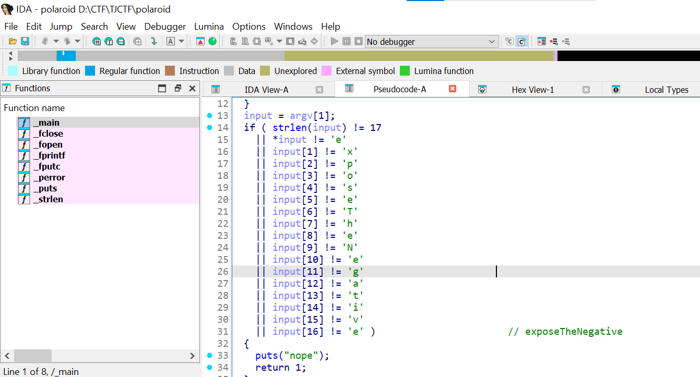
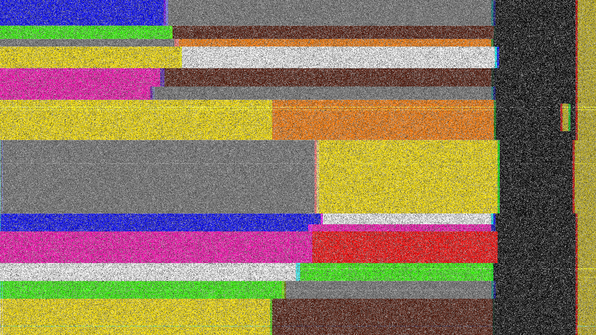

# TJCTF_2026

Giải này đánh cùng D1nhDwc ngon choét <3

# RE (giải cho đúng 4 câu RE thì câu 4 ko ai giải được ☹️)

## Polaroid

Cho file MacOS



dưới có mỗi cái này


→ code solve:

```python
import os

def decrypt_to_png(input_filepath, output_filepath, key_string):
    key_bytes = key_string.encode('utf-8')
    key_length = len(key_bytes) # Bằng 17 (0x11)
    print(f"[*] Đang đọc dữ liệu từ: {input_filepath}")
    with open(input_filepath, 'rb') as f:
        encrypted_data = f.read()
    decrypted_data = bytearray()
    for i in range(len(encrypted_data)):
        decrypted_byte = encrypted_data[i] ^ key_bytes[i % key_length]
        decrypted_data.append(decrypted_byte)
        
    # Ghi dữ liệu đã giải mã ra file PNG mới
    print(f"[*] Đang xuất file PNG ra: {output_filepath}")
    with open(output_filepath, 'wb') as f:
        f.write(decrypted_data)
        
    print("[+] Hoàn tất! File ảnh đã sẵn sàng.")

if __name__ == "__main__":
    INPUT_FILE = r'D:\CTF\TJCTF\_encrypted.txt' 
    OUTPUT_FILE = r'D:\CTF\TJCTF\decrypted.png'
    KEY = 'exposeTheNegative'
    
    if os.path.exists(INPUT_FILE):
        decrypt_to_png(INPUT_FILE, OUTPUT_FILE, KEY)
    else:
        print(f"[!] Không tìm thấy file {INPUT_FILE}. Hãy kiểm tra lại đường dẫn.")
```

<aside>
💡

Flag: `tjctf{develop_the_picture}`

</aside>

## remoose


đọc bin bằng HxD thì thấy định dạng hơi lạ, mình lướt xuống thấy của linux và đề có đề cập đến change 1 little thing nên mình nghĩ file này phải là elf. 


```python
printf '\x46' | dd of=chall bs=1 seek=3 count=1 conv=notrunc
```

Sửa xong mới biết là sửa mỗi magic bytes là không đủ, mấy 0x20 (space) đằng sau cũng lỗi, đáng ra phải là 0x0, minhf gen code AI

```python
from pathlib import Path
import struct

inp="chall"
out="chall_fixed"

b=bytearray(Path(inp).read_bytes())

# 1. ELK -> ELF
b[0:4]=b"\x7fELF"

# 2. Byte lỗi chính: nhiều byte nhỏ bị biến thành 0x20
# Đổi tạm 0x20 về 0x00
for i in range(len(b)):
    if b[i]==0x20:
        b[i]=0x00

def w4(off,val):
    b[off:off+4]=struct.pack("<I",val)

def w8(off,val):
    b[off:off+8]=struct.pack("<Q",val)

# =========================
# Program header
# =========================

ph=0x40
phsz=56

# LOAD segment chứa .rodata/.eh_frame
o=ph+4*phsz
w8(o+8,0x2000)
w8(o+16,0x2000)
w8(o+24,0x2000)

# GNU_EH_FRAME
o=ph+8*phsz
w8(o+8,0x200c)
w8(o+16,0x200c)
w8(o+24,0x200c)

# =========================
# Section header
# =========================

sh=0x3a28
shsz=64

def sh_w4(i,off,val):
    w4(sh+i*shsz+off,val)

def sh_w8(i,off,val):
    w8(sh+i*shsz+off,val)

# .note sections: SHT_NOTE = 7
sh_w4(2,4,7)
sh_w4(3,4,7)
sh_w8(3,32,0x20)

# .gnu.version_r size
sh_w8(8,32,0x20)

# .plt
sh_w8(12,16,0x1020)
sh_w8(12,24,0x1020)

# .rodata
sh_w8(16,16,0x2000)
sh_w8(16,24,0x2000)

# .eh_frame_hdr
sh_w8(17,16,0x200c)
sh_w8(17,24,0x200c)

# .eh_frame
sh_w8(18,16,0x2070)
sh_w8(18,24,0x2070)

# .shstrtab
sh_w8(29,24,0x3920)
sh_w8(29,32,0x108)

# =========================
# Dynamic section
# =========================

D=0x2df8

w8(D+10*16,0x8c)      # DT_STRSZ = 0x8c
w8(D+15*16+8,7)       # DT_PLTREL = RELA
w8(D+17*16,7)         # DT_RELA

# =========================
# Dynsym
# =========================
# Các weak symbol cần st_info = 0x20
# Nếu bị thành 0x00 thì __gmon_start__ có thể làm crash _init
for idx in [2,5,6]:
    b[0x330+idx*24+4]=0x20

# =========================
# Relocation
# =========================

# .rela.dyn entry cuối: __cxa_finalize, type = R_X86_64_GLOB_DAT = 6
w8(0x4b0+7*24+8,(7<<32)|6)

# .rela.plt entry 0: putchar
w8(0x570+0*24,0x4018)
w8(0x570+0*24+8,(1<<32)|7)

# .rela.plt entry 1: printf
w8(0x570+1*24,0x4020)
w8(0x570+1*24+8,(3<<32)|7)

# =========================
# Patch code
# =========================

# main:
# 114e: e8 2c 00 00 00    call 117f <flag>
# opcode e8 ở 0x114e, immediate bắt đầu ở 0x114f
b[0x114e]=0xe8
b[0x114f]=0x2c
b[0x1150]=0x00
b[0x1151]=0x00
b[0x1152]=0x00

# main return 0 thay vì return 1
# 1153: b8 00 00 00 00    mov $0,%eax
b[0x1154]=0x00

# flag4:
# 120b: e8 20 fe ff ff    call 1030 <putchar@plt>
b[0x120c]=0x20

Path(out).write_bytes(b)
print(f"wrote {out}")
```

[https://www.notion.so](https://www.notion.so)

<aside>
💡

→ Flag: tjctf{5ma11_m00s3}

</aside>

## Rotated

Lúc đầu cho file lỗi đ giải được ☠️. Tên bài rotated hint là từng byte độc lập nên mình nghĩ tới xoay từng bits trong bytes, mình cho lên mrGPT thì nó phát hiện ra rotate byte: -0x1d / +0xe3 sẽ ra được file ELF

```python
#!/usr/bin/env python3
from pathlib import Path
import sys

def rol8(x, n):
    n &= 7
    return ((x << n) & 0xff) | (x >> (8 - n)) if n else x

def ror8(x, n):
    n &= 7
    return (x >> n) | ((x << (8 - n)) & 0xff) if n else x

MAGICS = {
    b"\x7fELF": "ELF",
    b"MZ": "PE/DOS MZ",
    b"PK\x03\x04": "ZIP",
    b"\x89PNG\r\n\x1a\n": "PNG",
    b"%PDF": "PDF",
}

def identify(buf):
    return [name for sig, name in MAGICS.items() if buf.startswith(sig)]

def main():
    if len(sys.argv) < 2:
        print(f"usage: {sys.argv[0]} chall1")
        return 1

    inp = Path(sys.argv[1])
    data = inp.read_bytes()

    print(f"[*] input: {inp} ({len(data)} bytes)")

    # 1) bit rotations, as the hints suggest
    for direction, fn in [("rol", rol8), ("ror", ror8)]:
        for r in range(8):
            out = bytes(fn(b, r) for b in data)
            ids = identify(out)
            if ids:
                name = f"{inp.name}.{direction}{r}.bin"
                Path(name).write_bytes(out)
                print(f"[+] bit {direction} {r}: {ids} -> {name}")

    # 2) ROT on byte values modulo 256.
    #    This is the actual hit for chall1: subtract 0x1d from every byte.
    for k in range(256):
        out_add = bytes((b + k) & 0xff for b in data)
        ids = identify(out_add)
        if ids:
            name = f"{inp.name}.add_{k:02x}.bin"
            Path(name).write_bytes(out_add)
            print(f"[+] byte add 0x{k:02x}: {ids} -> {name}")

        out_sub = bytes((b - k) & 0xff for b in data)
        ids = identify(out_sub)
        if ids:
            name = f"{inp.name}.sub_{k:02x}.bin"
            Path(name).write_bytes(out_sub)
            print(f"[+] byte sub 0x{k:02x}: {ids} -> {name}")

if __name__ == "__main__":
    raise SystemExit(main())

```

*Note: Chạy ra 2 file giống hệt nhau nhé, dùng file nào cũng được

File kia nó bị pack 


Pack thì unpack ra thôi


Unpack mở lên bằng IDA được


Trong bash này có nhiều phần gọi lệnh trống làm rối, AI giải vây ra được

```python
fd = open("script.sh", 577, 493);
=open("script.sh", O_WRONLY | O_CREAT | O_TRUNC, 0755);
```

Đoạn bash thực chất là:

```python
eval "$(printf 'H4sIAEDAzmkC/0tNzshXUPLJz8/OzEtXSMsvUkhUSMtJTLdXUlBWSHEvyEpxjzKPzAo0THSzzPY18jL0y7Es8XMJNfY19rJ0Tre1BQCGqZA9QQAAAA==' | base64 -d | gunzip -c)"
```

Giải ra được:


```python
echo "Looking for a flag?" # dGpjdGZ7YjQ1aF9kM2J1Nl9tNDU3M3J9Cg==
```


<aside>
💡

→ Flag: tjctf{b45h_d3bu6_m4573r}

</aside>

# Crypto

## Crashout

Tuy chưa làm được nhưng rất tiếc vì đã tìm được loại cipher rồi nhưng ko làm được.


Chỉ cần đổi hết các kí tự về A xong thay kí tự cuối sẽ ra flag

<aside>
💡

Flag: tjctf{I_HAVE_NO_AAAS_BUT_I_MUST_SCREAM}

</aside>

## **minervas-stopwatch**


Cho file txt có public key trên curve P256 với tọa độ Qx, Qy

```python
P-256 public key coordinates
Qx = a51b379a175d3a2593d698e47379becb0c1a541357bca5aa8324edf182a7ac44
Qy = 00c4b6868e9610c21282b31fb59d988f842fa4179ce9803c84de2501391cc656

```

trace.csv thì có nhiều bản ghi chữ kí dạng này

```python
id,msg_hex,h,r,s,elapsed_ns
```

điểm cần chú ý là tham số cuối

→ ECDSA kí theo công thức:

```python
s=k^-1*(h+r*d) mod n
d = private key
k = nonce
n = order của curve
```

→ nếu biết k sẽ tính được d

sau khi sắp xếp thì thấy tham số cuối có delta rất nhỏ → bruteforce k nhỏ rồi kiểm tra bằng public key→ ra d

Cách bruteforce thì ta có tham số cuối của elap nhỏ nhất rất nhỏ, bất thường lắm


nên ta brute k theo số bit (có gợi ý của AI) bằng công thức:

```python
d=((s*k-h)*pow(r,-1,n))%n 
```

sau đó kiểm tra bằng công thức:

```python
d*G == Q
```

được kết quả:

```python
d=0x58286af25b10220cf0f979081becc352de791dabdf90205b84a92537e18a78d1
```

Phần còn lại dùng AI ra được cách tạo flag bằng cách dùng:

```python
seed=sha256(d.to_bytes(32,"big")).digest()
stream=sha256(seed+(0).to_bytes(4,"big")).digest()
```

sau đó XOR flag.enc với stream

<aside>
💡

→ Flag: tjctf{m1n3rv4_h34rd_th3_n0nc3_tick}

</aside>

# MISC:

## dancing birb

Cho đúng 1 file mp4


Lúc đầu mình nghĩ tới các kiểu trừ âm thanh/dùng sóng stegno/… nhưng không được.

Một hồi tự dưng mình nghĩ tới Sherlock Homes và thấy mấy con này nhảy nhảy nhộn nhịp vãi nên đi tìm. Bingo!


Tách file mp4 kia ra thành nhiều frame nhất có thể:

```python
ffmpeg -i birb.mp4 frame_%04d.png
```


Cứ lướt rồi điền dần thì ra flag:

<aside>
💡

→ Flag: tjctf{da_birb_got_some_movez}

</aside>

## Glitch

Cho mỗi file PNG này



Mình thấy các thanh màu tự dưng dài bất thường, đã thế đề bài còn như này:


Mình nhớ có 1 cipher tên là resistor (yeah tôi ngu lý nhưng tôi nhớ cipher này)


Liệt kê màu rồi cho vào AI ra được:

```python
blue gray -> 68 -> D 
green brown -> 51 -> 3 
gray orange -> 83 -> S 
yellow white -> 49 -> 1 
violet brown -> 71 -> G 
violet gray -> 78 -> N 
yellow orange -> 43 -> + 
gray yellow -> 84 -> T 
blue white -> 69 -> E 
blue violet -> 67 -> C
violet red -> 72 -> H 
white green -> 95 -> _ 
green gray -> 58 -> : 
yellow brown -> 41 -> )
```

<aside>
💡

Flag: tjctf{D3S1GN+TECH_:)}

</aside>

## Find da code:


Bài này không có gì cả, có 4 mã thôi nên cứ brute vậy.

Trong quá trình brute sẽ thấy 4 mã này xuất hiện đi xuất hiện lại nhiều lần trong bộ câu hỏi.

```python
"0X88D1","0X1A2B","0X9C4F","0X00FA"
```

Nên đây là code solve:

```python
#!/usr/bin/env python3
from pwn import *
import re

HOST="tjc.tf"
PORT=31004

context.log_level="error"

CODES={
    "0X88D1",
    "0X1A2B",
    "0X9C4F",
    "0X00FA",
}

def read_stage(p,stage):
    data=p.recvuntil(f"Enter choice for stage {stage} (1-10):".encode(),timeout=5)
    text=data.decode(errors="ignore")
    opts=re.findall(r"(\d+)\.\s+(0x[0-9A-Fa-f]{4})",text)
    opts=[(int(i),v.upper()) for i,v in opts]
    return opts,text

def solve_once():
    p=remote(HOST,PORT)

    chosen=[]

    for stage in range(1,5):
        opts,text=read_stage(p,stage)
        print(text)

        candidates=[]
        for idx,val in opts:
            if val in CODES:
                candidates.append((idx,val))

        if not candidates:
            print(f"[!] Stage {stage}: không thấy code nào thuộc bộ nhớ")
            p.close()
            return False

        # thường chỉ có đúng 1 candidate
        idx,val=candidates[0]
        print(f"[+] Stage {stage}: choose {idx} -> {val}")
        chosen.append(val)
        p.sendline(str(idx).encode())

    out=p.recvall(timeout=5).decode(errors="ignore")
    print(out)

    if "tjctf{" in out.lower() or "flag" in out.lower() or "success" in out.lower():
        return True

    return False

def main():
    for attempt in range(20):
        print(f"\n========== ATTEMPT {attempt+1} ==========")
        if solve_once():
            break

if __name__=="__main__":
    main()
```

Hình như 1 phát ăn luôn chứ ko có brute gì cả ý =)))

<aside>
💡

→ Flag: tjctf{brut3_f0rc3_th3_t3rm1n4l}

</aside>

## Jumper


Bài này dễ vãi chỉ có vào điều khiển con nhân vật nhảy 1 lần là được nên mình sẽ để đây


<aside>
💡

→ Flag: tjctf{PAST_THE_WALL}

</aside>

## Where-the-hell-am-I?


Finally my 5hrs into Osint!!!

Nó bắt mình tìm chuỗi 9 địa điểm liên tiếp qua ảnh chụp 360

Ừ đây là địa điểm của từng chỗ

1. **Paris Las Vegas** chỗ sân bay paradise nhìn lên **36.1122486, -115.1726941**
2. **Prospect Mountain 43.4238583, -73.7453256**
3. Chỗ này bắt đầu khó, cho mỗi cái hành lang, nvm look what I found

[School shooting threat empties Jefferson – tjTODAY](https://www.tjtoday.org/38051/showcase/school-shooting-threat-empties-jefferson/)


**38.8189033, -77.1686646**

1. **Cotso gần trường: 38.8497378, -77.3712097**
2. Cho mỗi cái ảnh của cha nội **Carlo Guy,** điểm đặc biệt là mình thấy cha này đang cầm tiền 20 đô Canada, mình tìm thì thấy cha này đang đi bến phà Horne’s Ferry, vừa hay giá đi xe ô tô qua là 15-20 đô. **[44.1355859,-76.3543566](https://www.google.com/maps/place/Horne's+Ferry/@44.1355859,-76.3543566,3a,75y,168.64h,96.14t/data=!3m8!1e1!3m6!1sCIHM0ogKEICAgID4sOTQ2wE!2e10!3e11!6shttps:%2F%2Flh3.googleusercontent.com%2Fgpms-cs-s%2FABJJf51Mm0UiW54CEebjhBvUuTSBe8CSV-MR9CqS6_BJ9qvmX0_d5Ox2vpIOUiNc_AsdA6sw5HY6a9tEKMGebQnTQj1YTN2qSX-iPYRCux0waK4ljufUYDGi0iD-UZhONyU2mtHv3gB4%3Dw900-h600-k-no-pi-6.140000000000001-ya43.20132507324219-ro0-fo100!7i7200!8i3600!4m7!3m6!1s0x89d806dcc68ebe31:0x38487ebac512dfff!8m2!3d44.1309208!4d-76.3365537!10e5!16s%2Fg%2F1tdn0hq8?hl=en-ID&entry=ttu&g_ep=EgoyMDI2MDUxMy4wIKXMDSoASAFQAw%3D%3D)** 
3. Brute-force mọi chỗ mà UnderwaterWorld lặn quay ảnh 360. [**5.8849168,-162.0601349**](https://www.google.com/maps/place/Palmyra/@5.8849168,-162.0601349,3a,75y,328.23h,79.58t/data=!3m8!1e1!3m6!1sCIHM0ogKEICAgICE7NX2cw!2e10!3e11!6shttps:%2F%2Flh3.googleusercontent.com%2Fgpms-cs-s%2FABJJf51Nu3ICfbE2itxTl7r6RR_iTxC8ZwtCBLWXoawpSee-KVH4E0PQerKdbgkJAb-ejcApluxlPUmyMCGnYEP3jwx2cOr9I384WSGJQVqGc4rI8XFC5tknY4qbTfzoQNl0GIxXL7s%3Dw900-h600-k-no-pi10.420000000000002-ya328.23-ro0-fo100!7i9500!8i4750!4m7!3m6!1s0x7a3ea440cc386595:0xeeb4000b2a8ea3bf!8m2!3d5.8885026!4d-162.0786656!10e5!16zL20vMDV0dmo?entry=ttu&g_ep=EgoyMDI2MDUxMy4wIKXMDSoASAFQAw%3D%3D)
4. Bài này dùng Gemini ra khá nhanh: [**36.821974,10.1041405**](https://www.google.com/maps/place/Madagascar/@-20.1493558,44.5014063,2a,75y,351.66h,51.86t/data=!3m7!1e1!3m5!1sVPeWsd1M6cKa7w12GJzwLg!2e0!6shttps:%2F%2Fstreetviewpixels-pa.googleapis.com%2Fv1%2Fthumbnail%3Fcb_client%3Dmaps_sv.tactile%26w%3D900%26h%3D600%26pitch%3D38.13503602936731%26panoid%3DVPeWsd1M6cKa7w12GJzwLg%26yaw%3D351.6602899844241!7i13312!8i6656!4m6!3m5!1s0x21d1a4e3ea238545:0x5244e3c1977b1388!8m2!3d-18.766947!4d46.869107!16zL20vMDRzajM?entry=ttu&g_ep=EgoyMDI2MDUxMy4wIKXMDSoASAFQAw%3D%3D)
5. Tìm được rừng rồi, tìm được đường rồi nhưng vẫn phải lái xe đúng 1h để tìm địa điểm. [**-20.1493558,44.5014063**](https://www.google.com/maps/place/Madagascar/@-20.1493558,44.5014063,2a,75y,351.66h,51.86t/data=!3m7!1e1!3m5!1sVPeWsd1M6cKa7w12GJzwLg!2e0!6shttps:%2F%2Fstreetviewpixels-pa.googleapis.com%2Fv1%2Fthumbnail%3Fcb_client%3Dmaps_sv.tactile%26w%3D900%26h%3D600%26pitch%3D38.13503602936731%26panoid%3DVPeWsd1M6cKa7w12GJzwLg%26yaw%3D351.6602899844241!7i13312!8i6656!4m6!3m5!1s0x21d1a4e3ea238545:0x5244e3c1977b1388!8m2!3d-18.766947!4d46.869107!16zL20vMDRzajM?entry=ttu&g_ep=EgoyMDI2MDUxMy4wIKXMDSoASAFQAw%3D%3D)
6. Chỗ này suýt nữa thì bỏ cuộc, tự dưng Đức gửi [cái này](https://brunch.co.kr/@himada/6?fbclid=IwY2xjawR4CXhleHRuA2FlbQIxMABicmlkETFQd2hBS0ZzSkhYaHpFVmlmc3J0YwZhcHBfaWQQMjIyMDM5MTc4ODIwMDg5MgABHvREPw7OLdvMY-KuamFrXxjlpVZbW7FQu8lFhrbnexYo1Eu5mKYIgYrP870C_aem_UCfv-kAKHyZRyLhsxEir1A)


Mình đọc thì thấy họ vừa đi đền này về và gặp cái khu nhà kia


→ Mình dựa vào đường gạch của khu kia để tìm trên GG map và ra được địa điểm

What a relief. [34.893956,135.8108096](https://www.google.com/maps/@34.893956,135.8108096,3a,75y,25.42h,95.58t/data=!3m7!1e1!3m5!1s7jK0gDCPcnFr2XzMlL4vNg!2e0!6shttps:%2F%2Fstreetviewpixels-pa.googleapis.com%2Fv1%2Fthumbnail%3Fcb_client%3Dmaps_sv.tactile%26w%3D900%26h%3D600%26pitch%3D-5.577549976389619%26panoid%3D7jK0gDCPcnFr2XzMlL4vNg%26yaw%3D25.41655634906561!7i16384!8i8192?entry=ttu&g_ep=EgoyMDI2MDUxMy4wIKXMDSoASAFQAw%3D%3D) ft D1nhDwc!!


<aside>
💡

Note cho osint: 

- T thấy mọi người chủ yếu dùng gg lens (có vẻ nó mạnh vl), gg maps và gemini
- Khi dùng gg lens có thể fake ip sang khu vực khác để tìm kiếm dễ hơn
</aside>

<aside>
💡

→ Flag: tjctf{y0u_ar3_a_g30gu3ssr_g0d!} 

</aside>